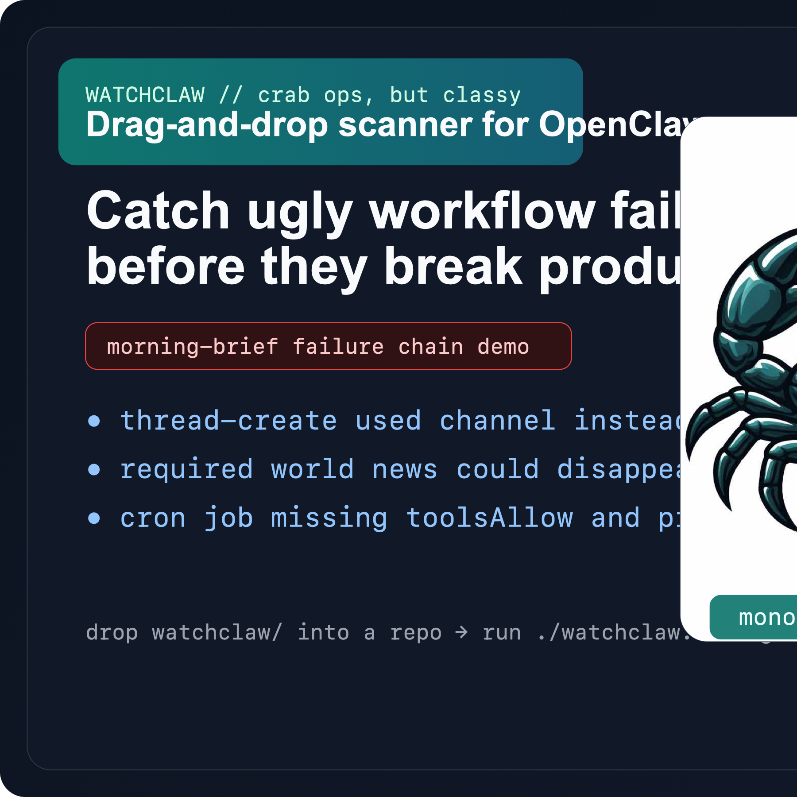
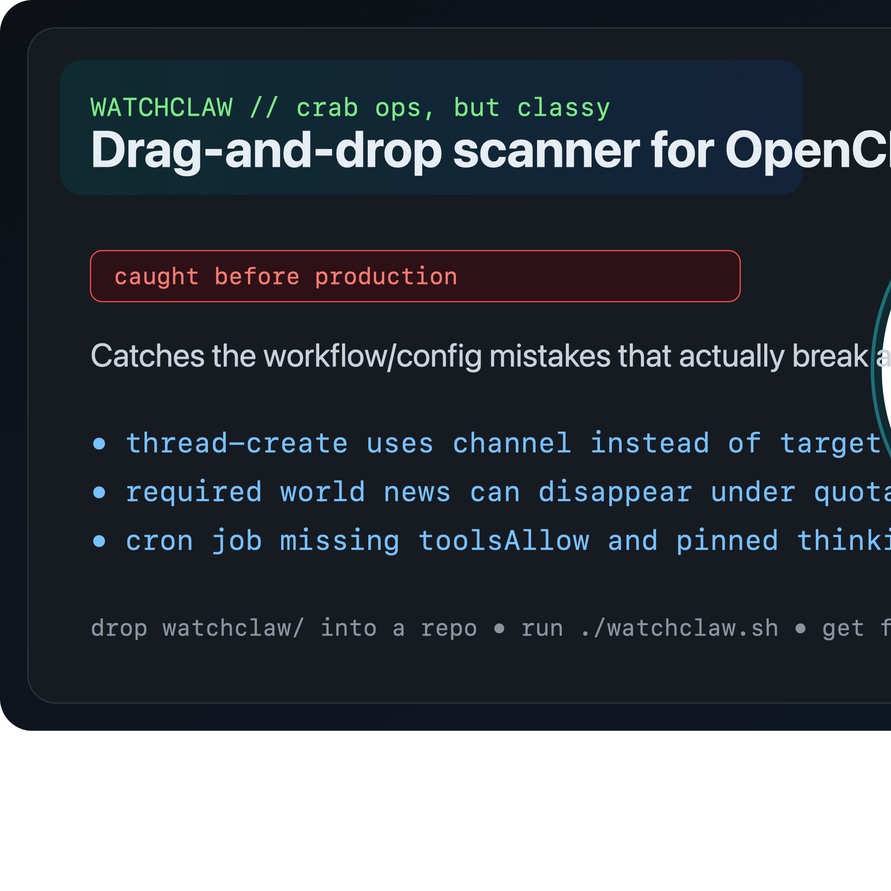
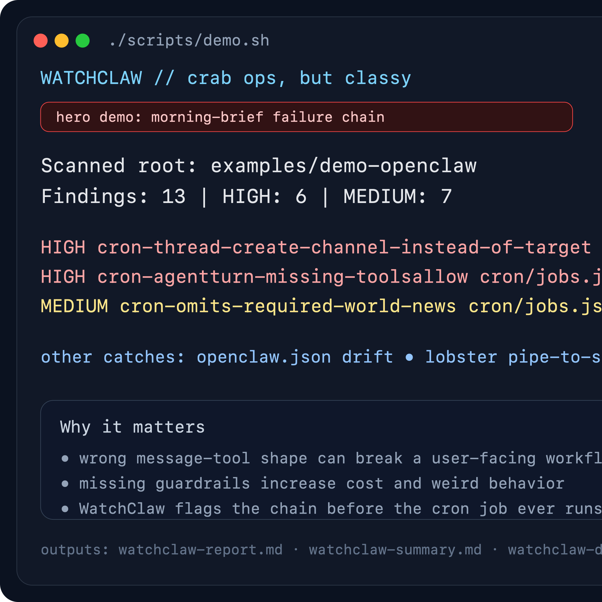

# WatchClaw

**Drag-and-drop scanner for OpenClaw repos.**



**Drop `watchclaw/` into an OpenClaw tree, run one command, and catch risky docs, unsafe workflow patterns, and token-burn clues in one scan.**

WatchClaw is an OpenClaw-native scanner focused on two high-value jobs:

1. **catch risky docs/workflow issues before they spread**
2. **surface usage, spend, and runtime anomalies before they become incidents**

It is built for maintainers and power users running OpenClaw in real environments who need better visibility into:

- unsafe or misleading documentation snippets
- risky workflow / prompt / config patterns
- broken or suspicious links in docs
- usage spikes and token burn
- repeated runtime failures
- alert routing for high-severity events

## Drag-and-drop quick start

If you want the fastest path to value, treat WatchClaw like a portable repo tool instead of a package install project:

```text
openclaw/
  docs/
  scripts/
  openclaw.json
  watchclaw/
```

Then run it from inside the vendored folder:

```bash
cd watchclaw
./watchclaw.sh
```

That wrapper just runs the same local scan (`PYTHONPATH=src python3 -m watchclaw.cli scan ..`) with less typing. No network shortcuts, no extra privilege, same local behavior.

That is the main product move: **copy it in, run it, get findings immediately.**

## What it catches in the demo

The bundled demo is intentionally small and immediately legible. One scan now tells a more painful OpenClaw story:

- a morning-brief style scheduled job that uses `thread-create` with `channel` instead of `target`
- the same job allowing `BREAKING WORLD NEWS` to disappear under quota pressure
- a cron job with missing `toolsAllow` and no thinking pin
- an orphan `openclaw.json` key that hints at a bad write path
- a dangerous `.lobster` pipeline that curls straight into `bash`
- session logs showing rate-limit churn and compaction pressure

That gives strangers a fast answer to the only question that really matters on first visit: **what badness does this catch right away?**

## Why this is more than a generic scanner

WatchClaw now catches OpenClaw-native failure shapes that generic repo scanners usually miss, including:

- `.lobster` commands that pull remote code straight into a shell
- `cron/jobs.json` scheduled agent turns missing `toolsAllow`
- `cron/jobs.json` scheduled agent turns with no explicit `thinking` mode
- orphan top-level keys in `openclaw.json` that hint at a bad write path or config drift
- session logs showing compaction/context-pressure markers instead of just generic token counts

That is the real wedge: **drop it into an OpenClaw tree and it catches the kinds of mistakes we actually debug in production.**

## Example: the kind of bug this should catch

The headline demo is now a morning-brief style failure chain: a scheduled job teaches `thread-create` with `channel` instead of `target`, and the same prompt says it can omit `BREAKING WORLD NEWS` if search fails.

WatchClaw flags both before the job ever runs. It also flags the missing `toolsAllow` and unpinned `thinking` mode sitting next to them in `cron/jobs.json`.

That is the kind of mistake that turns into multi-day workflow breakage, missing user-facing sections, weird behavior, or unnecessary spend if nobody notices early.

## Why someone would actually use it

WatchClaw is for the moment when an OpenClaw repo looks mostly fine, but you still want a quick pass over the surfaces that cause real operator pain:

- docs people copy-paste without thinking
- workflow files that can quietly become unsafe
- usage/session logs that hint at cost or reliability trouble

It is not trying to replace an observability stack. It is trying to catch high-signal mistakes fast.

## More ways to run it

### Refresh the demo in one command

```bash
./scripts/demo.sh
```

### Run against the current repo

```bash
PYTHONPATH=src python3 -m watchclaw.cli scan .
```

### What `watchclaw.sh` does

```bash
#!/usr/bin/env bash
set -euo pipefail
cd "$(dirname "$0")"
PYTHONPATH=src python3 -m watchclaw.cli scan .. "$@"
```

### Run from a vendored `watchclaw/` folder inside OpenClaw

```bash
cd watchclaw
./watchclaw.sh
```

### Emit all launch-ready outputs

```bash
PYTHONPATH=src python3 -m watchclaw.cli scan examples/demo-openclaw \
  --markdown-out examples/demo-openclaw/watchclaw-report.md \
  --github-out examples/demo-openclaw/watchclaw-summary.md \
  --discord-out examples/demo-openclaw/watchclaw-discord.txt \
  --json-out examples/demo-openclaw/watchclaw-findings.json
```

See also: `examples/demo-openclaw/`.

## Demo outputs

The repo includes a tiny OpenClaw-style demo tree with pre-generated outputs so visitors can see the result before installing anything:

- `examples/demo-openclaw/watchclaw-report.md`
- `examples/demo-openclaw/watchclaw-summary.md`
- `examples/demo-openclaw/watchclaw-discord.txt`
- `examples/demo-openclaw/watchclaw-findings.json`

That gives new visitors a fast proof-of-value without making them guess what the tool emits.

## Demo

### One-command demo refresh

```bash
./scripts/demo.sh
```

### Demo screenshots

**Hero card**



**Terminal scan run**



### Demo outputs in this repo

- `examples/demo-openclaw/watchclaw-report.md`
- `examples/demo-openclaw/watchclaw-summary.md`
- `examples/demo-openclaw/watchclaw-discord.txt`
- `examples/demo-openclaw/watchclaw-findings.json`

### Exact demo command

```bash
PYTHONPATH=src python3 -m watchclaw.cli scan examples/demo-openclaw \
  --markdown-out examples/demo-openclaw/watchclaw-report.md \
  --github-out examples/demo-openclaw/watchclaw-summary.md \
  --discord-out examples/demo-openclaw/watchclaw-discord.txt \
  --json-out examples/demo-openclaw/watchclaw-findings.json
```

### Demo summary output

This is the proof-of-value snapshot a stranger should be able to understand in a few seconds. Notice that the top findings now center on a real OpenClaw workflow failure chain instead of generic scanner bait:

```md
## WatchClaw Summary

- scanned root: `examples/demo-openclaw`
- total findings: **13**
- high: **6**
- medium: **7**

### Top findings

- `cron-thread-create-channel-instead-of-target` in `cron/jobs.json:1` — AgentTurn prompt teaches thread-create with `channel` instead of `target`, which can break posting.
- `cron-agentturn-missing-toolsallow` in `cron/jobs.json:1` — AgentTurn cron job is missing toolsAllow, which can lead to broader-than-intended tool access.
- `cron-omits-required-world-news` in `cron/jobs.json:1` — AgentTurn prompt allows BREAKING WORLD NEWS to be omitted even though the section is part of the required brief shape.
- `openclaw-orphan-top-level-key` in `openclaw.json:1` — openclaw.json contains an unexpected top-level key that may indicate drift or a bad write path.
- `lobster-remote-shell-pipe` in `workflows/deploy.lobster:2` — Lobster command pipes a remote download directly into a shell.
- `context-compaction-pressure` in `agents/main/sessions/demo.jsonl:3` — Context overflow or compaction diagnostics appeared in session logs.
```

### Demo Discord alert output

```text
⚠️ WatchClaw found 11 issue(s) in `demo-openclaw`: [HIGH] unsafe-workflow-interpolation at .github/workflows/demo.yml:7; [HIGH] lobster-remote-shell-pipe at workflows/deploy.lobster:2; [HIGH] curl-pipe-shell at docs/install.md:6 (+8 more)
```

## Why WatchClaw exists

OpenClaw already has strong building blocks for workflows, watchdog behavior, and security-minded automation. What is still missing is a focused tool that treats **docs safety**, **workflow safety**, and **usage monitoring** as one operational surface.

WatchClaw fills that gap.

Instead of acting like a generic uptime checker, WatchClaw is meant to watch the things OpenClaw users actually trip over:

- docs people copy and run
- examples that can drift into insecure patterns
- workflow files that deserve security scrutiny
- usage patterns that quietly turn into cost or reliability problems

## Positioning

WatchClaw is not a SIEM.

WatchClaw is not a heavy setup story.

WatchClaw is not a full incident-management platform.

WatchClaw is a sharp, OpenClaw-specific scanner that helps maintainers catch:

- **docs security problems**
- **workflow security problems**
- **OpenClaw-specific config and scheduling mistakes**
- **usage and spend anomalies**
- **high-signal operational regressions**

## Initial use cases

### 1. Docs security scanning

Scan OpenClaw docs and markdown-heavy surfaces for:

- dangerous shell examples
- suspicious remote-script patterns
- token / credential leaks in examples
- unsafe links or redirect patterns
- prompt-injection bait in instructional content
- localization drift that reintroduces unsafe examples

### 2. Workflow and config monitoring

Review workflow and automation surfaces for:

- risky command execution patterns
- unsafe interpolation
- insecure install flows
- brittle integrations
- alert-routing regressions

### 3. Usage monitoring

Track runtime signals such as:

- sudden spend spikes
- token pressure and context bloat
- repeated rate-limit failures
- agent-specific anomaly patterns
- missing telemetry or broken accounting

### 4. Escalation

Route findings through the channels operators already use:

- Discord
- Telegram / WhatsApp where available
- optional SMS / phone escalation via external transports such as Twilio

## What makes it interesting

WatchClaw is compelling because it sits directly on the OpenClaw surface area instead of treating OpenClaw like just another app behind a ping check.

That makes it useful for:

- OpenClaw maintainers
- self-hosters
- power users running multiple agents
- contributors working on docs, workflows, and security-sensitive integrations

## v1 scope

The first version should stay tight:

- docs and markdown security checks
- workflow/config security checks
- usage anomaly detection
- high-signal Discord alerting
- simple daily or on-demand summaries

## Non-goals for v1

- full enterprise incident management
- broad infrastructure observability
- generic cloud monitoring
- trying to replace PagerDuty, Grafana, or a SIEM

## Suggested tagline options

- **WatchClaw — security and usage watchdog for OpenClaw**
- **WatchClaw — monitor OpenClaw docs, workflows, and spend**
- **WatchClaw — OpenClaw-native monitoring for docs safety and usage anomalies**

## Roadmap direction

Short term:

- preserve drag-and-drop portability as a core design constraint while the tool grows
- add a `.lobster` workflow entrypoint so WatchClaw can run in a cost-efficient OpenClaw-native automation path
- define the core signal model
- ship docs/workflow checks
- ship usage anomaly summaries
- prove alert quality

Medium term:

- add remediation hints
- add repo-native GitHub reporting
- add optional phone/SMS escalation
- support more OpenClaw surfaces and integrations

## Status

Portable starter implementation is live. Soft-launch shaping in progress.

## Design principle: drag-and-drop first

WatchClaw is intentionally being designed as a **drag-and-drop-first** tool.

That means the default experience should stay simple:

- drop the `watchclaw/` folder into an OpenClaw checkout
- run it locally against the parent repo
- get useful findings and outputs immediately

This portability is not just a convenience feature — it is part of the product strategy.
WatchClaw should feel easy to trial, easy to trust, and easy to wire into real OpenClaw workflows without forcing a heavyweight setup.

## Drag-and-drop OpenClaw mode

WatchClaw is intentionally designed to work as a portable folder inside an OpenClaw checkout.

Example layout:

```text
openclaw/
  docs/
  scripts/
  openclaw.json
  watchclaw/
```

Then run it from inside the vendored folder:

```bash
python -m watchclaw scan ..
```

The scanner will try to detect the surrounding OpenClaw-style repo root automatically.

## Starter implementation

This bootstrap includes:

- a minimal Python package layout
- OpenClaw-root auto-detection
- a first docs-safety rule for risky `curl|sh` / `wget|bash` style snippets
- markdown report generation
- tests proving the drag-and-drop scan model

## Current checks

WatchClaw currently ships with high-signal starter checks for:

- risky docs shell snippets (`curl | sh`, `wget | bash`)
- suspicious links in docs (`javascript:`, raw IP links, shortened links)
- live-looking token examples in docs
- unsafe GitHub-context interpolation in executable workflow content
- remote-script execution patterns in workflow files
- repeated rate-limit events in session/usage logs
- oversized token turns in usage/session logs

## Output formats

A single scan can emit:

- full markdown report
- GitHub-ready markdown summary
- compact Discord alert text
- JSON findings payload
