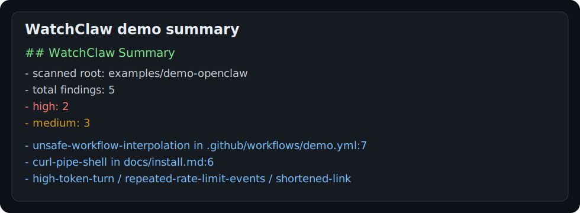
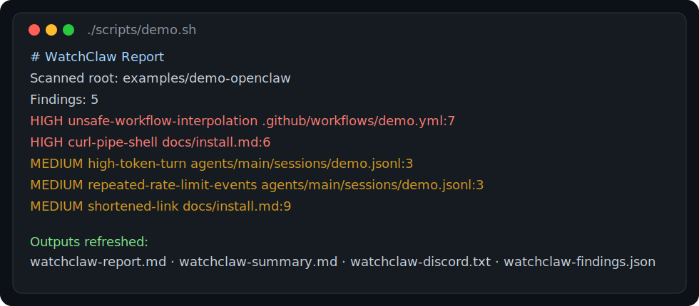

# WatchClaw

**Security and usage watchdog for OpenClaw.**

WatchClaw is an OpenClaw-native watchdog focused on two high-value jobs:

1. **catch risky docs/workflow issues before they spread**
2. **surface usage, spend, and runtime anomalies before they become incidents**

It is built for maintainers and power users running OpenClaw in real environments who need better visibility into:

- unsafe or misleading documentation snippets
- risky workflow / prompt / config patterns
- broken or suspicious links in docs
- usage spikes and token burn
- repeated runtime failures
- alert routing for high-severity events

## Quick start

### Refresh the demo in one command

```bash
./scripts/demo.sh
```

### Run against the current repo

```bash
PYTHONPATH=src python3 -m watchclaw.cli scan .
```

### Run from a vendored `watchclaw/` folder inside OpenClaw

```bash
PYTHONPATH=src python3 -m watchclaw.cli scan ..
```

### Emit all launch-ready outputs

```bash
PYTHONPATH=src python3 -m watchclaw.cli scan examples/demo-openclaw \
  --markdown-out examples/demo-openclaw/watchclaw-report.md \
  --github-out examples/demo-openclaw/watchclaw-summary.md \
  --discord-out examples/demo-openclaw/watchclaw-discord.txt \
  --json-out examples/demo-openclaw/watchclaw-findings.json
```

See also: `watchclaw.toml.example` and `examples/demo-openclaw/`.

## Demo outputs

The repo now includes a tiny OpenClaw-style demo tree with pre-generated outputs:

- `examples/demo-openclaw/watchclaw-report.md`
- `examples/demo-openclaw/watchclaw-summary.md`
- `examples/demo-openclaw/watchclaw-discord.txt`
- `examples/demo-openclaw/watchclaw-findings.json`

That gives new visitors a fast proof-of-value without making them guess what the tool emits.

## Demo

### One-command demo refresh

```bash
./scripts/demo.sh
```

### Demo screenshots

**GitHub-style summary**



**Terminal scan run**



### Demo outputs in this repo

- `examples/demo-openclaw/watchclaw-report.md`
- `examples/demo-openclaw/watchclaw-summary.md`
- `examples/demo-openclaw/watchclaw-discord.txt`
- `examples/demo-openclaw/watchclaw-findings.json`

### Exact demo command

```bash
PYTHONPATH=src python3 -m watchclaw.cli scan examples/demo-openclaw \
  --markdown-out examples/demo-openclaw/watchclaw-report.md \
  --github-out examples/demo-openclaw/watchclaw-summary.md \
  --discord-out examples/demo-openclaw/watchclaw-discord.txt \
  --json-out examples/demo-openclaw/watchclaw-findings.json
```

### Demo summary output

```md
## WatchClaw Summary

- scanned root: `examples/demo-openclaw`
- total findings: **5**
- high: **2**
- medium: **3**

### Top findings

- `unsafe-workflow-interpolation` in `.github/workflows/demo.yml:7` — Potentially unsafe GitHub context interpolation in executable workflow content.
- `curl-pipe-shell` in `docs/install.md:6` — Remote script execution pattern detected.
- `high-token-turn` in `agents/main/sessions/demo.jsonl:3` — Large single-turn token usage detected.
- `repeated-rate-limit-events` in `agents/main/sessions/demo.jsonl:3` — Repeated rate-limit events detected in usage/session logs.
- `shortened-link` in `docs/install.md:9` — Shortened link detected in documentation.
```

### Demo Discord alert output

```text
⚠️ WatchClaw found 5 issue(s) in `demo-openclaw`: [HIGH] unsafe-workflow-interpolation at .github/workflows/demo.yml:7; [HIGH] curl-pipe-shell at docs/install.md:6; [MEDIUM] high-token-turn at agents/main/sessions/demo.jsonl:3 (+2 more)
```

## Why WatchClaw exists

OpenClaw already has strong building blocks for workflows, watchdog behavior, and security-minded automation. What is still missing is a focused tool that treats **docs safety**, **workflow safety**, and **usage monitoring** as one operational surface.

WatchClaw fills that gap.

Instead of acting like a generic uptime checker, WatchClaw is meant to watch the things OpenClaw users actually trip over:

- docs people copy and run
- examples that can drift into insecure patterns
- workflow files that deserve security scrutiny
- usage patterns that quietly turn into cost or reliability problems

## Positioning

WatchClaw is not a SIEM.

WatchClaw is not a full incident-management platform.

WatchClaw is a sharp, OpenClaw-specific watchdog that helps maintainers catch:

- **docs security problems**
- **workflow security problems**
- **usage and spend anomalies**
- **high-signal operational regressions**

## Initial use cases

### 1. Docs security scanning

Scan OpenClaw docs and markdown-heavy surfaces for:

- dangerous shell examples
- suspicious remote-script patterns
- token / credential leaks in examples
- unsafe links or redirect patterns
- prompt-injection bait in instructional content
- localization drift that reintroduces unsafe examples

### 2. Workflow and config monitoring

Review workflow and automation surfaces for:

- risky command execution patterns
- unsafe interpolation
- insecure install flows
- brittle integrations
- alert-routing regressions

### 3. Usage monitoring

Track runtime signals such as:

- sudden spend spikes
- token pressure and context bloat
- repeated rate-limit failures
- agent-specific anomaly patterns
- missing telemetry or broken accounting

### 4. Escalation

Route findings through the channels operators already use:

- Discord
- Telegram / WhatsApp where available
- optional SMS / phone escalation via external transports such as Twilio

## What makes it interesting

WatchClaw is compelling because it sits directly on the OpenClaw surface area instead of treating OpenClaw like just another app behind a ping check.

That makes it useful for:

- OpenClaw maintainers
- self-hosters
- power users running multiple agents
- contributors working on docs, workflows, and security-sensitive integrations

## v1 scope

The first version should stay tight:

- docs and markdown security checks
- workflow/config security checks
- usage anomaly detection
- high-signal Discord alerting
- simple daily or on-demand summaries

## Non-goals for v1

- full enterprise incident management
- broad infrastructure observability
- generic cloud monitoring
- trying to replace PagerDuty, Grafana, or a SIEM

## Suggested tagline options

- **WatchClaw — security and usage watchdog for OpenClaw**
- **WatchClaw — monitor OpenClaw docs, workflows, and spend**
- **WatchClaw — OpenClaw-native monitoring for docs safety and usage anomalies**

## Roadmap direction

Short term:

- add a `.lobster` workflow entrypoint so WatchClaw can run in a cost-efficient OpenClaw-native automation path
- define the core signal model
- ship docs/workflow checks
- ship usage anomaly summaries
- prove alert quality

Medium term:

- add remediation hints
- add repo-native GitHub reporting
- add optional phone/SMS escalation
- support more OpenClaw surfaces and integrations

## Status

Portable starter implementation is live. Soft-launch shaping in progress.

## Drag-and-drop OpenClaw mode

WatchClaw is intentionally designed to work as a portable folder inside an OpenClaw checkout.

Example layout:

```text
openclaw/
  docs/
  scripts/
  openclaw.json
  watchclaw/
```

Then run it from inside the vendored folder:

```bash
python -m watchclaw scan ..
```

The scanner will try to detect the surrounding OpenClaw-style repo root automatically.

## Starter implementation

This bootstrap includes:

- a minimal Python package layout
- OpenClaw-root auto-detection
- a first docs-safety rule for risky `curl|sh` / `wget|bash` style snippets
- markdown report generation
- tests proving the drag-and-drop scan model

## Current checks

WatchClaw currently ships with high-signal starter checks for:

- risky docs shell snippets (`curl | sh`, `wget | bash`)
- suspicious links in docs (`javascript:`, raw IP links, shortened links)
- live-looking token examples in docs
- unsafe GitHub-context interpolation in executable workflow content
- remote-script execution patterns in workflow files
- repeated rate-limit events in session/usage logs
- oversized token turns in usage/session logs

## Output formats

A single scan can emit:

- full markdown report
- GitHub-ready markdown summary
- compact Discord alert text
- JSON findings payload
